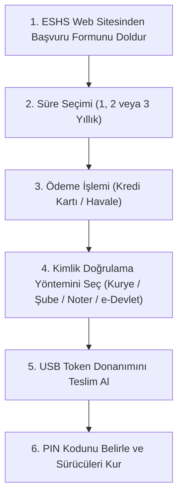

# Sıfırdan E-İmza Alma Rehberi: Başvuru Adımları, Evraklar ve Yasal Statü ✍️📜

> **Kategori:** E-İmza (Elektronik İmza)  
> **Hedef Kitle:** Bireysel Kullanıcılar, Şirket Yöneticileri, Serbest Meslek Sahipleri, Avukatlar  
> **Tahmini Okuma Süresi:** 6 dakika  
> **Son Güncelleme:** 2026

---

## 📌 Giriş ve Yasal Dayanak

Elektronik imza (e-imza), **5070 Sayılı Elektronik İmza Kanunu** uyarınca, elle atılan ıslak imza ile **birebir aynı hukuki sonucu** doğuran sayısal bir kimlik doğrulama ve onaylama aracıdır. E-imza ile imzalanan bir belge, mahkemeler ve resmi daireler nezdinde kesin senet delili sayılır.

E-imza temelde iki bileşenden oluşur:
1. **Nitelikli Elektronik Sertifika (NES):** Bilgi Teknolojileri ve İletişim Kurumu (BTK) tarafından yetkilendirilmiş bir Elektronik Sertifika Hizmet Sağlayıcısı (ESHS) tarafından kimliğinize tanımlanır.
2. **Güvenli Elektronik İmza Oluşturma Aracı (USB Token / Akıllı Kart):** Sertifikanızı barındıran ve özel kriptografik anahtarınızın (Private Key) dışarıya kopyalanamamasını sağlayan donanımsal güvenlik çipi.

---

## 📋 Kimler E-İmza Almalıdır?

* **Şirket Yetkilileri:** MERSİS işlemleri, KEP gönderimi, kamu ihaleleri (EKAP) ve bankacılık onayları için.
* **Avukatlar ve Hukukçular:** UYAP Avukat Portalı üzerinden dava açma, dilekçe gönderme ve e-duruşmaya katılma için.
* **Mali Müşavirler (SMMM & YMM):** Mükellef bildirimleri ve e-beyanname onayları için.
* **Sağlık Çalışanları & Hekimler:** SGK Medula sistemi üzerinden e-reçete onayları için.
* **Vatandaşlar:** Web Tapu devir işlemleri, e-Devlet kapısı yüksek güvenlikli girişleri ve sözleşme imzalamaları için.

---

## 🏢 BTK Yetkili Elektronik Sertifika Hizmet Sağlayıcıları (ESHS)

Türkiye'de yalnızca BTK tarafından resmi lisans verilmiş 6 sağlayıcı e-imza üretebilir:

1. **TÜBİTAK BİLGEM Kamu Sertifikasyon Merkezi (Kamu SM):** Kamu kurum personeli ve Mali Mühür başvuruları için. ([kamusm.bilgem.tubitak.gov.tr](https://kamusm.bilgem.tubitak.gov.tr/))
2. **TÜRKTRUST Bilgi İletişim ve Bilişim Güvenliği Hizmetleri A.Ş.** ([turktrust.com.tr](https://www.turktrust.com.tr/))
3. **E-Güven (Elektronik Bilgi Güvenliği A.Ş.)** ([e-guven.com](https://www.e-guven.com/))
4. **E-Tuğra EBG Bilişim Teknolojileri ve Hizmetleri A.Ş.** ([e-tugra.com.tr](https://www.e-tugra.com.tr/))
5. **TN KEP / TN Bilişim Teknolojileri A.Ş.**
6. **Yetkili Diğer Özel Sağlayıcılar (EDM Bilişim, Klon Bilişim vb.)**

---

## 📝 Başvuru İçin Gerekli Belgeler

### 1. Bireysel Başvuru (Gerçek Kişiler İçin)
* T.C. Kimlik Kartı, Nüfus Cüzdanı veya geçerlilik süresi dolmamış Pasaport aslı.
* ESHS başvuru formu ve Nitelikli Elektronik Sertifika Taahhütnamesi.

### 2. Kurumsal Başvuru (Şirket Temsilcileri İçin)
* İmza sahibinin T.C. Kimlik Kartı.
* Şirketin son 6 aya ait Ticaret Sicil Gazetesi veya Faaliyet Belgesi.
* Şirket İmza Sirküleri fotokopisi.
* Şirket adına e-imza almaya yetkili olduğunu gösterir yetkilendirme yazısı.

---

## 🚀 Adım Adım Başvuru ve Teslim Alma Süreci

1. **Online Başvuru:** Tercih ettiğiniz ESHS web sitesine girerek süreyi (genellikle 1, 2 veya 3 yıl) seçin ve formu doldurun.
2. **Kimlik Teyidi:**
   * **Adreste Kimlik Tespiti (Kurye):** Yetkili kurye adresinize gelir, kimliğinizi çipli okuyucu ile doğrular ve sözleşmeyi imzalatır.
   * **Ofisten / Başvuru Merkezinden Teslim:** Aynı gün içinde sağlayıcının şubesine giderek 15 dakikada elden teslim alabilirsiniz.
   * **Nüfus Müdürlüğü (T.C. Kimlik Kartına Yükleme):** Yeni çipli kimlik kartınız varsa, e-imzanızı kimlik kartınızın çipine yükletebilirsiniz.
3. **PIN Belirleme:** Cihazı teslim aldıktan sonra ESHS'nin online işlemler portalına girerek ilk kullanım için 6 haneli güvenlik PIN kodunuzu oluşturun.

---

## 💡 Dikkat Edilmesi Gereken Kritik Noktalar

> [!IMPORTANT]
> **PIN Kodunuzu Asla Paylaşmayın:** 5070 Sayılı Kanun'un 15. maddesi gereğince, güvenli elektronik imzanın oluşturulması verilerinin (PIN/Token) korunması ve üçüncü şahıslara kullandırılmamasından sertifika sahibi **bizzat ve hukuken sorumludur.** E-imzanız ile atılan tüm imzalar sizi bağlar.

> [!TIP]
> **Süre Tercihi:** 3 yıllık sertifika almak yıllık yenileme masraflarını ve zaman kaybını yaklaşık %35 oranında azaltır.

---

## ❓ Sıkça Sorulan Sorular (SSS)

**S: E-İmza ile Mali Mühür aynı şey midir?**  
C: Hayır. Bireysel e-imza gerçek kişiyi (şahıs veya şirket imza yetkilisini) temsil eder. Mali mühür ise tüzel kişiliği (şirketin elektronik kaşesini) temsil eder.

**S: Bilgisayarım e-imza cihazını görmüyor, ne yapmalıyım?**  
C: AKİS veya SafeNet sürücüsünün yüklü olduğunu ve Windows Akıllı Kart (`SCardSvr`) hizmetinin çalıştığını kontrol ediniz. Açık kaynaklı [akilli-kart-surucu-teshis](https://github.com/eimza-kep/akilli-kart-surucu-teshis) aracımızla tek tıkla arıza tespiti yapabilirsiniz.
