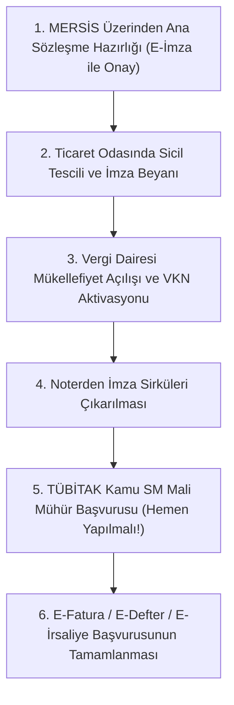

# Yeni Limited ve Anonim Şirket Kuruluşunda Mali Mühür Rehberi 🏢⏱️

> **Kategori:** Mali Mühür  
> **Hedef Kitle:** Yeni Girişimciler, Şirket Ortakları, Mali Müşavirler  
> **Tahmini Okuma Süresi:** 5 dakika  
> **Son Güncelleme:** 2026

---

## 📌 Şirket Kuruluş Aşamalarında Mali Mühür Ne Zaman Gerekir?

Yeni bir sermaye şirketi (Limited Şirket veya Anonim Şirket) kurarken girişimcilerin en çok tereddüt ettiği konulardan biri mali mührün tam olarak hangi aşamada sipariş edileceğidir.

Kritik kural: **Şirket ticaret siciline tescil edilmeden ve Vergi Kimlik Numarası (VKN) oluşmadan mali mühür başvurusu YAPILAMAZ.**

Çünkü Kamu SM başvuru ekranı doğrudan GİB Vergi Dairesi ve MERSİS veri tabanlarını anlık sorgular. Şirketin vergi kaydı aktif değilse sistem hata verir.

---

## 🗓️ Kuruluş Sürecinde Doğru Zamanlama Çizelgesi

1. **MERSİS Aşaması:** Kurucular kendi şahsi **Bireysel E-İmzaları** ile ana sözleşmeyi imzalar (Mali mühür henüz yoktur).
2. **Sicil Tescili:** Şirket tüzel kişilik kazanır ve 10 haneli VKN tanımlanır.
3. **İmza Sirküleri:** Noterden şirket yetkilisinin imza sirküleri çıkarılır.
4. **Mali Mühür Başvurusu:** Tescilden hemen sonraki 1-2 iş günü içinde Kamu SM başvurusu yapılmalıdır!

---

## ⚠️ Neden Gecikilmemeli?

Yeni kurulan bir şirket fatura kesmek, KEP adresi almak veya e-dönüşüm entegratörüne kaydolmak için mali mührü beklemek zorundadır.
* Kamu SM teslimatı 3-7 iş günü sürer.
* Mühür gecikirse şirketin müşterilerine fatura kesmesi ve tahsilat yapması aksayabilir.
* Bu sebeple imza sirküleri çıktığı gün Kamu SM ödemesi yapılmalıdır.

---

## 💡 Alternatif: Şahıs Şirketlerinde Durum Nedir?

Şahıs işletmelerinde tüzel kişilik bulunmadığından:
* Mali mühür almak **zorunlu değildir.**
* Kurucunun kendi adına kayıtlı TCKN'li **Bireysel E-İmzası** hem e-Fatura hem de e-Arşiv süreçleri için hukuken yeterlidir.
