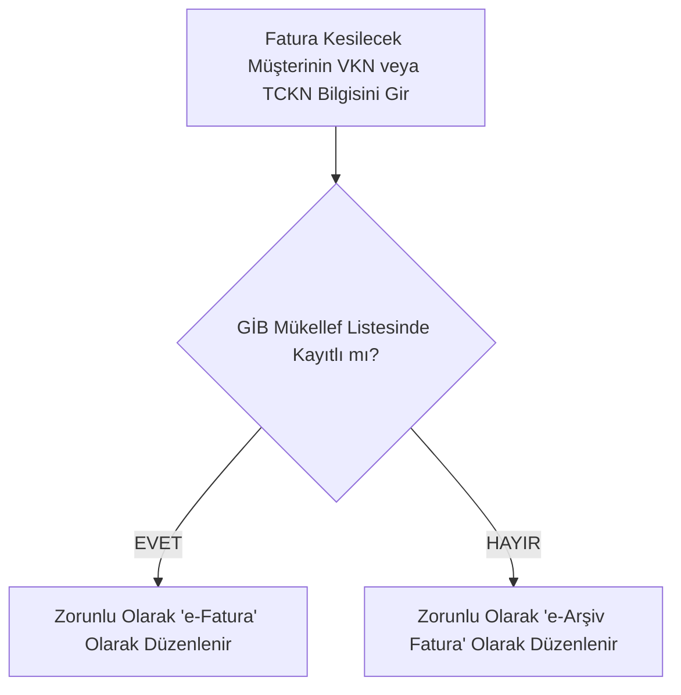

# e-Fatura ile e-Arşiv Fatura Arasındaki Farklar Nelerdir? 🧾⚖️

> **Kategori:** e-Fatura & e-Arşiv  
> **Hedef Kitle:** Muhasebe Çalışanları, Satış Temsilcileri, Şirket Yöneticileri, Esnaflar  
> **Tahmini Okuma Süresi:** 5 dakika  
> **Son Güncelleme:** 2026

---

## 📌 Giriş: İki Belge Arasındaki Temel Ayrım

Mali mevzuatta hem e-Fatura hem de e-Arşiv Fatura elektronik ortamda üretilen yasal belgelerdir. Ancak aralarındaki temel fark **alıcının mükellefiyet türüdür**:

* **e-Fatura:** Her iki tarafın da (hem satıcının hem alıcının) **GİB e-Fatura sistemine kayıtlı olduğu** durumlarda kesilen faturadır.
* **e-Arşiv Fatura:** Satıcının e-Fatura kullanıcısı olduğu, ancak **alıcının e-Fatura sisteminde kayıtlı olmadığı** (nihai tüketici / vatandaş veya sisteme dahil olmayan küçük esnaf) durumlarda kesilen faturadır.

---

## 📊 Kapsamlı Karşılaştırma Matrisi

| Özellik | e-Fatura | e-Arşiv Fatura |
| :--- | :--- | :--- |
| **Alıcı Taraf** | Sadece e-Fatura Mükellefleri | e-Faturaya kayıtlı olmayan mükellefler ve son tüketiciler |
| **İletim Kanalı** | **GİB Sunucuları üzerinden doğrudan** alıcının sistemine düşer | E-posta, SMS veya çıktısı alınarak kağıt olarak teslim edilir |
| **Format** | UBL-TR XML (Kriptografik zarf) | PDF / HTML görsel ve XML |
| **İptal / İtiraz Yolu** | GİB e-Fatura İptal/İtiraz Portalı veya KEP/Noter | e-Arşiv Fatura Portalı üzerinden veya iade faturasıyla |
| **GİB Raporlaması** | Anlık olarak GİB sisteminden geçer | Entegratör tarafından ertesi gün saat 24:00'e kadar GİB'e raporlanır |

---

## 🚀 Pratik Karar Ağacı: Faturayı Nasıl Keseceğim?

Muhasebe programınızda fatura keserken şu kural işler:



> [!WARNING]
> **Kritik Hata (Kağıt veya e-Arşiv Kesme Yasağı):**
> Eğer müşteriniz GİB e-Fatura kayıtlı kullanıcısı ise, ona sehven e-Arşiv fatura kesemez veya kağıt fatura veremezsiniz! Sistem bu faturayı geçersiz sayar ve VUK uyarınca her iki tarafa da fatura tutarının %10'u oranında özel usulsüzlük cezası kesilebilir.

---

## 🛠️ UBL-TR XML Faturasını Görüntüleme

Elinizde `.xml` formatında bir e-fatura veya e-arşiv belgesi varsa, kodlama bilmeden modern HTML formatında görüntülemek ve PDF çıktısı almak için açık kaynaklı [e-fatura-xml-goruntuleyici](https://github.com/eimza-kep/e-fatura-xml-goruntuleyici) aracımızı kullanabilirsiniz:

```bash
# Terminalde özet gösterir:
python ubl_viewer.py fatura.xml

# Tarayıcıda açar ve Yazdır/PDF butonu sunar:
python ubl_viewer.py fatura.xml --html
```
