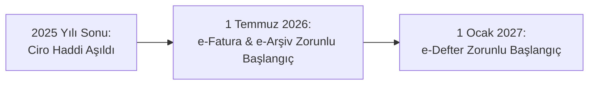

# e-Fatura ve e-Defter Zorunluluk Limitleri & Ciro Hadleri 📈🏛️

> **Kategori:** e-Fatura & e-Defter  
> **Hedef Kitle:** Şirket Sahipleri, Mali Müşavirler, Denetçiler, KOBİ Yöneticileri  
> **Tahmini Okuma Süresi:** 5 dakika  
> **Son Güncelleme:** 2026

---

## 📌 GİB Genel Tebliği Kapsamı (509 Sıra No.lu VUK Genel Tebliği)

Gelir İdaresi Başkanlığı, her yıl yayımladığı Vergi Usul Kanunu Genel Tebliğleri ile e-Fatura ve e-Defter uygulamasına geçiş zorunluluğu olan brüt satış hasılatı (ciro) limitlerini ve sektörel kriterleri belirlemektedir.

Belirlenen ciro limitini aşan mükellefler, izleyen yılın **1 Temmuz** tarihine kadar e-Fatura ve e-Arşiv Fatura uygulamasına, izleyen yılın **1 Ocak** tarihine kadar ise e-Defter uygulamasına geçmek mecburiyetindedir.

---

## 📊 Genel ve Sektörel Geçiş Limitleri Tablosu

| Sektör / Faaliyet Alanı | e-Fatura Zorunluluk Şartı | e-Defter Zorunluluk Şartı |
| :--- | :--- | :--- |
| **Genel Ticari İşletmeler (Tüm Sektörler)** | Brüt satış hasılatı **3 Milyon TL** ve üzeri | e-Faturaya geçen tüm mükellefler |
| **E-Ticaret Yapanlar (Kendi sitesi veya Pazaryeri)** | Brüt satış hasılatı **500 Bin TL** ve üzeri | e-Fatura zorunluluğu olanlar |
| **Gayrimenkul / Motorlu Taşıt Alım-Satım & Kiralama** | Brüt satış hasılatı **500 Bin TL** ve üzeri | e-Fatura zorunluluğu olanlar |
| **İnternet Reklamcılığı Hizmet Aracıları** | Brüt satış hasılatı **500 Bin TL** ve üzeri | e-Fatura zorunluluğu olanlar |
| **ÖTV I ve III Sayılı Liste Kapsamındakiler** | **Ciro şartı aranmaksızın** doğrudan zorunlu | e-Faturaya geçenler |
| **EPDK Lisanslı Petrol / LPG Bayileri** | **Ciro şartı aranmaksızın** doğrudan zorunlu | e-Faturaya geçenler |
| **Kültür ve Turizm Bakanlığı Belgeli Oteller** | **Ciro şartı aranmaksızın** doğrudan zorunlu | e-Faturaya geçenler |

---

## 🗓️ Geçiş Takvimi ve Süreler

Örneğin 2025 yılı hesap döneminde cirosu 3 Milyon TL'yi aşan bir mükellef için takvim şöyle işler:

1. **1 Temmuz:** Şirket mali mühür temin etmiş ve e-Fatura entegrasyonunu tamamlamış olmalıdır. Bu tarihten itibaren kağıt fatura kesemez.
2. **İzleyen 1 Ocak:** e-Defter tutmaya başlar. Noterden fiziki yevmiye ve kebir defteri tasdiki yaptırma zorunluluğu ortadan kalkar.

---

## ⚠️ Süresinde Geçmemenin Cezası

Zorunluluk kapsamına girmesine rağmen belirlenen tarihe kadar e-Fatura veya e-Deftere geçmeyen mükelleflere:
* Vergi Usul Kanunu 353. maddesi uyarınca her bir fatura için özel usulsüzlük cezası,
* VUK Mükerrer 355. maddesi uyarınca bilgi vermeme ve elektronik sisteme dahil olmama cezası kesilir.
* Ayrıca fiziki tutulan defterler yok hükmünde sayılacağından **KDV indirimlerinin reddedilmesi** riski doğar!
